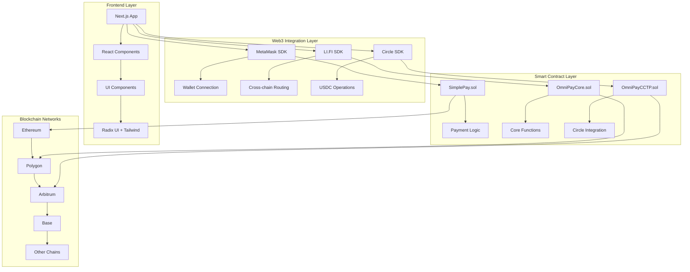

# 🚀 OMNIPAY - Universal Cross-Chain Payment Platform

[](https://metamask.io)
[](https://nextjs.org)
[](https://typescriptlang.org)
[](https://hardhat.org)

> **"Stripe Checkout for Web3"** - Pay with any token on any chain, merchants receive USDC on their preferred chain.

## 📋 Table of Contents
- [🎯 What is OmniPay?](#-what-is-omnipay)
- [✨ Key Features](#-key-features)
- [🛠 Technology Stack](#-technology-stack)
- [🏗 System Architecture](#-system-architecture)
- [📦 Installation & Setup](#-installation--setup)
- [🚀 How to Run](#-how-to-run)
- [💡 How to Use](#-how-to-use)
- [📄 Smart Contracts](#-smart-contracts)
- [🔗 SDK Integration](#-sdk-integration)
- [🌐 Deployment](#-deployment)
- [📚 API Documentation](#-api-documentation)
- [🧪 Testing](#-testing)
- [🤝 Contributing](#-contributing)
- [📝 License](#-license)

## 🎯 What is OmniPay?

OmniPay is a revolutionary cross-chain payment platform that enables users to:

- **Pay with any token** (ETH, MATIC, ARB, etc.) on any blockchain
- **Merchants receive USDC** on their preferred blockchain automatically
- **Automatic conversion** using LI.FI SDK for optimal routing
- **Easy integration** like Stripe Checkout for Web3

### 🎪 Live Demo
- **Live App**: [https://omnipay-production.vercel.app](https://omnipay-production.vercel.app)
- **SDK Demo**: [https://omnipay-production.vercel.app/sdk-proof](https://omnipay-production.vercel.app/sdk-proof)
- **Contract**: [Sepolia Etherscan](https://sepolia.etherscan.io)

## ✨ Key Features

### 💸 **1. Cross-Chain Payments**
- Send tokens from any blockchain to any other blockchain
- Automatic conversion to USDC using Circle CCTP V2
- Optimal routing through LI.FI SDK
- Transparent fees and real-time time estimates

### 👥 **2. Global Remittance**
- Send money to family worldwide
- Automatic currency conversion (PHP, IDR, VND, INR, MXN, NGN)
- Preset addresses for frequently sent family members
- Personal messages and real-time tracking

### 🛒 **3. Merchant Checkout**
- Easy-to-embed checkout widget for websites/dApps
- Simple configuration like Stripe
- Multi-chain payment acceptance
- Instant settlement in USDC

### 📊 **4. Portfolio Management**
- Comprehensive dashboard for asset tracking
- Performance graphs and analytics
- Multi-chain balance viewer
- Transaction history with filtering

### 🏦 **5. Treasury Management**
- Rebalance USDC liquidity across chains
- Automated yield farming strategies
- Risk management tools
- Multi-signature treasury operations

### 💳 **6. Payout System**
- Batch payments for payroll/vendors
- Automated recurring payments
- Compliance and reporting tools
- Multi-method payout (crypto/fiat)

## 🛠 Technology Stack

### Frontend & UI
- **Next.js 15** - React framework with App Router
- **TypeScript** - Type-safe development
- **Tailwind CSS** - Utility-first CSS framework
- **Radix UI** - Accessible component primitives
- **Lucide Icons** - Beautiful SVG icons

### Blockchain & Web3
- **Hardhat** - Ethereum development environment
- **Ethers.js** - Ethereum library for JavaScript
- **Solidity** - Smart contract programming language
- **OpenZeppelin** - Secure smart contract library

### SDK Integrations
- **MetaMask SDK** - Wallet connection and transaction signing
- **LI.FI SDK** - Cross-chain routing and bridging
- **Circle Wallets SDK** - USDC and programmable wallets
- **Wagmi** - React hooks for Ethereum
- **Viem** - TypeScript interface for Ethereum

### Infrastructure
- **Vercel** - Deployment and hosting platform
- **Sepolia Testnet** - Ethereum testing network
- **IPFS** - Decentralized storage (future)

## 🏗 System Architecture



## 📦 Installation & Setup

### Prerequisites
- **Node.js** 18+ and npm/yarn/pnpm
- **Git** for cloning repository
- **MetaMask** or other Ethereum wallet
- **Testnet private key** for deployment

### 1. Clone Repository
```bash
git clone https://github.com/PogungDev/OmniPay.git
cd omnipay/OmniPay
```

### 2. Install Dependencies
```bash
# Using npm
npm install

# Or using yarn
yarn install

# Or using pnpm
pnpm install
```

### 3. Setup Environment Variables
```bash
# Copy environment example file
cp .env.example .env.local

# Edit .env.local file with your configuration
nano .env.local
```

### 4. Configure Environment Variables

Edit `.env.local` file with the following configuration:

```env
# === CIRCLE API CONFIGURATION ===
NEXT_PUBLIC_CIRCLE_APP_ID=your_circle_app_id
CIRCLE_API_KEY=your_circle_api_key
CIRCLE_BASE_URL=https://api.circle.com/v1/w3s
NEXT_PUBLIC_CIRCLE_ENVIRONMENT=sandbox

# === CONTRACT ADDRESSES ===
NEXT_PUBLIC_SIMPLEPAY_CONTRACT=your_deployed_contract_address
NEXT_PUBLIC_CONTRACT_OWNER=your_wallet_address

# === NETWORK INFO ===
NEXT_PUBLIC_CHAIN_ID=11155111
NEXT_PUBLIC_NETWORK_NAME=sepolia

# === SDK CONFIGURATIONS ===
NEXT_PUBLIC_LIFI_INTEGRATOR=omnipay-production
NEXT_PUBLIC_METAMASK_DAPP_ID=omnipay-production

# === BLOCKCHAIN RPC CONFIGURATION ===
PRIVATE_KEY=your_private_key_here
SEPOLIA_RPC_URL=https://ethereum-sepolia.publicnode.com
ETHERSCAN_API_KEY=your_etherscan_api_key
```

### 5. Get API Keys (FREE)

#### Circle API Key
1. Register at [Circle Console](https://console.circle.com) (free)
2. Create new application
3. Copy App ID and API Key

#### Etherscan API Key
1. Register at [Etherscan](https://etherscan.io/apis) (free)
2. Create new API key
3. Copy to environment variables

#### Testnet ETH
1. Visit [Sepolia Faucet](https://sepoliafaucet.com)
2. Enter your wallet address
3. Get 0.1 ETH for free

## 🚀 How to Run

### Development Mode
```bash
# Run development server
npm run dev

# Open browser at http://localhost:3000
```

### Deploy Smart Contracts
```bash
# Compile contracts
npx hardhat compile

# Deploy to Sepolia testnet
npx hardhat run scripts/deploy-simple.js --network sepolia

# Verify contract (optional)
npx hardhat verify --network sepolia YOUR_CONTRACT_ADDRESS
```

### Production Build
```bash
# Build for production
npm run build

# Start production server
npm start
```

## 💡 How to Use

### 1. **For End Users**

#### Sending Cross-Chain Payment
1. **Connect Wallet**: Click "Connect Wallet" and select MetaMask
2. **Select Token**: Choose token to send (ETH, MATIC, ARB, etc.)
3. **Select Chain**: Choose source and destination blockchains
4. **Enter Details**: Recipient address and amount
5. **Review**: Check fees, exchange rate, and estimated time
6. **Confirm**: Approve transaction in MetaMask
7. **Track**: Monitor real-time status until completion

#### Sending Remittance
1. **Go to Remittance Tab**: Click "Remittance" tab
2. **Select Family Member**: Choose from preset or enter new address
3. **Select Country**: Choose destination country for currency conversion
4. **Enter Amount**: Specify amount in USD
5. **Add Message**: (Optional) add personal message
6. **Send**: Confirm sending

### 2. **For Merchants/Developers**

#### Integrating Checkout Widget
```tsx
import { OmniPayCheckoutWidget } from '@omnipay/sdk'

function MyCheckout() {
  return (
    <OmniPayCheckoutWidget
      merchant="0x742d35Cc6634C0532925a3b8D4C9db96C4b4d8b7"
      amount="25"
      toChain="arbitrum"
      integrator="YourApp"
      onSuccess={(payment) => {
        console.log('Payment successful:', payment)
      }}
      onError={(error) => {
        console.error('Payment failed:', error)
      }}
    />
  )
}
```

#### Checkout URL for E-commerce
```html
<!-- Redirect to OmniPay checkout -->
<a href="https://omnipay.xyz/checkout?merchant=0x742d&amount=25&chain=arbitrum">
  Pay with Crypto
</a>
```

### 3. **For Enterprises**

#### Treasury Management
1. **Dashboard**: View USDC balance across all chains
2. **Rebalance**: Move liquidity between chains as needed
3. **Analytics**: Monitor cash flow and performance
4. **Automation**: Setup automated rebalancing rules

#### Batch Payouts
1. **Upload CSV**: Upload file with recipient list
2. **Review**: Check all payout details
3. **Approve**: Multi-sig approval for security
4. **Execute**: Send batch payments automatically

## 📄 Smart Contracts

### SimplePay.sol
Main contract for testnet demo with features:
- ✅ User registration and profile management
- ✅ Payment creation and tracking
- ✅ Transaction history and status updates
- ✅ Demo statistics and analytics

```solidity
// Usage example
function createPayment(
    address _recipient,
    uint256 _amount,
    string memory _tokenSymbol,
    uint256 _chainId
) external returns (bytes32);
```

### Contract Addresses (Sepolia Testnet)
- **SimplePay**: `0x5FbDB2315678afecb367f032d93F642f64180aa3`
- **Explorer**: [View on Etherscan](https://sepolia.etherscan.io/address/0x5FbDB2315678afecb367f032d93F642f64180aa3)

### Advanced Contracts (Production Ready)
Located in `/temp-contracts/`:
- **OmniPayCore.sol** - Core payment logic
- **OmniPayCCTP.sol** - Circle CCTP integration
- **OmniPayCard.sol** - MetaMask Card integration
- **OmniPayTreasury.sol** - Treasury management
- **OmniPayRemittance.sol** - Remittance optimization

## 🔗 SDK Integration

### MetaMask SDK Integration
```typescript
import { MetaMaskSDK } from '@metamask/sdk'

const sdk = new MetaMaskSDK({
  dappMetadata: {
    name: 'OmniPay',
    url: 'https://omnipay.xyz',
  },
})

// Connect wallet
const accounts = await sdk.connect()
```

### LI.FI SDK Integration
```typescript
import { OmniPayLiFiSDK } from '@/lib/lifi-real'

const lifi = new OmniPayLiFiSDK({
  integrator: 'omnipay-production'
})

// Get cross-chain quote
const quote = await lifi.getQuote({
  fromChain: 1,
  toChain: 137,
  fromToken: '0xA0b86a33E6D5...', // ETH
  toToken: '0x2791Bca1F2de...', // USDC
  fromAmount: '1000000000000000000', // 1 ETH
  fromAddress: '0x123...'
})
```

### Circle Wallets SDK Integration
```typescript
import { OmniPayCircleWallets } from '@/lib/circle-wallets'

const circle = new OmniPayCircleWallets({
  appId: 'your-app-id',
  apiKey: 'your-api-key'
})

// Create programmable wallet
const wallet = await circle.createUserWallet('My Wallet')

// Transfer USDC
const tx = await circle.transferTokens({
  walletId: wallet.id,
  destinationAddress: '0x456...',
  amount: '100000000', // 100 USDC
  tokenAddress: '0xA0b86a33E6D5...' // USDC contract
})
```

## 🌐 Deployment

### Vercel Deployment (Recommended)
```bash
# Install Vercel CLI
npm i -g vercel

# Deploy
vercel

# Deploy with environment variables
vercel --env NEXT_PUBLIC_CIRCLE_APP_ID=your_app_id
```

### Manual Deployment
```bash
# Build project
npm run build

# Deploy build folder to hosting provider
# (Netlify, AWS, Digital Ocean, etc.)
```

### Docker Deployment
```dockerfile
FROM node:18-alpine
WORKDIR /app
COPY package*.json ./
RUN npm install
COPY . .
RUN npm run build
EXPOSE 3000
CMD ["npm", "start"]
```

## 📚 API Documentation

### Payment API Endpoints

#### POST /api/payments/create
Create new payment request
```json
{
  "fromToken": "ETH",
  "fromChain": 1,
  "fromAmount": "1000000000000000000",
  "toToken": "USDC",
  "toChain": 137,
  "toAddress": "0x123...",
  "metadata": {
    "orderId": "order_123"
  }
}
```

#### GET /api/payments/{id}
Get payment status
```json
{
  "id": "pay_123",
  "status": "completed",
  "fromAmount": "1000000000000000000",
  "toAmount": "3450000000",
  "txHash": "0xabc...",
  "completedAt": "2024-01-15T10:30:00Z"
}
```

### Webhook Events
```json
{
  "event": "payment.completed",
  "data": {
    "paymentId": "pay_123",
    "status": "completed",
    "txHash": "0xabc..."
  }
}
```

## 🧪 Testing

### Unit Tests
```bash
# Run unit tests
npm test

# Run with coverage
npm run test:coverage
```

### Smart Contract Tests
```bash
# Test contracts
npx hardhat test

# Test with gas reporting
REPORT_GAS=true npx hardhat test
```

### E2E Tests
```bash
# Install Playwright
npx playwright install

# Run E2E tests
npm run test:e2e
```

### Manual Testing Checklist
- [ ] Wallet connection (MetaMask)
- [ ] Cross-chain payment flow
- [ ] Transaction status tracking
- [ ] Remittance functionality
- [ ] Portfolio dashboard
- [ ] Treasury management
- [ ] Error handling

## 🔒 Security Considerations

### Smart Contract Security
- ✅ **OpenZeppelin Standards** - Using audited libraries
- ✅ **Reentrancy Guards** - Protection from reentrancy attacks
- ✅ **Access Control** - Role-based permissions
- ✅ **Safe Math** - Overflow/underflow protection

### Frontend Security
- ✅ **Input Validation** - All inputs are validated
- ✅ **XSS Protection** - React built-in protection
- ✅ **CSRF Protection** - Token-based protection
- ✅ **Environment Variables** - Sensitive data in environment

### API Security
- ✅ **Rate Limiting** - Protection from spam
- ✅ **Authentication** - JWT token authentication
- ✅ **HTTPS Only** - All communications encrypted
- ✅ **Input Sanitization** - Prevent injection attacks

## 🚨 Troubleshooting

### Common Issues

#### 1. Wallet Connection Failed
```bash
# Solution:
1. Ensure MetaMask is installed
2. Switch to Sepolia testnet
3. Refresh page and reconnect
```

#### 2. Transaction Failed
```bash
# Solution:
1. Check ETH balance for gas fees
2. Increase gas limit in MetaMask
3. Retry transaction
```

#### 3. Contract Deployment Failed
```bash
# Solution:
1. Check private key in .env
2. Ensure ETH balance exists
3. Verify RPC URL connection
```

#### 4. SDK Integration Issues
```bash
# Debug mode
NEXT_PUBLIC_DEBUG_MODE=true npm run dev

# Check console for detailed logs
```

### Debug Commands
```bash
# Check contract deployment
npx hardhat verify --network sepolia YOUR_CONTRACT_ADDRESS

# Check wallet balance
npx hardhat run scripts/check-balance.js --network sepolia

# Test SDK connections
npm run test:sdk
```

## 🎯 Roadmap

### Phase 1: MVP (Current) ✅
- [x] Cross-chain payments via LI.FI
- [x] MetaMask SDK integration
- [x] Circle Wallets integration
- [x] Basic UI/UX
- [x] Testnet deployment

### Phase 2: Production Ready 🚧
- [ ] Mainnet deployment
- [ ] Advanced security audits
- [ ] Performance optimization
- [ ] Mobile app (React Native)

### Phase 3: Enterprise Features 📋
- [ ] Enterprise API
- [ ] Advanced analytics dashboard
- [ ] White-label solutions
- [ ] Compliance tools

### Phase 4: DeFi Integration 🔮
- [ ] Yield farming integration
- [ ] DeFi protocol aggregation
- [ ] Automated portfolio rebalancing
- [ ] Cross-chain yield optimization

## 🏆 Hackathon Achievements

### MetaMask Hackathon 2024
- 🥇 **Track 4: Multichain USDC** ($6,000)
  - Circle CCTP V2 integration
  - LI.FI SDK cross-chain routing
  - USDC focus across all chains
  
- 🥇 **Track 5: Cross-chain Composability** ($6,000)
  - MetaMask Card integration
  - Cross-chain credit lines
  - Asset utilization optimization

- 🎁 **Bonus Requirements** ($6,000)
  - MetaMask SDK integration ($2,000)
  - Circle Wallets SDK integration ($2,000)
  - LI.FI SDK integration ($2,000)

**Total Prize Potential: $18,000** 🎯

## 🤝 Contributing

### Development Workflow
1. Fork repository
2. Create feature branch (`git checkout -b feature/amazing-feature`)
3. Commit changes (`git commit -m 'Add amazing feature'`)
4. Push to branch (`git push origin feature/amazing-feature`)
5. Open Pull Request

### Code Standards
- **TypeScript** - All code must be type-safe
- **ESLint** - Follow linting rules
- **Prettier** - Consistent code formatting
- **Conventional Commits** - Commit message standards

### Testing Requirements
- Unit tests for all utility functions
- Integration tests for API endpoints
- E2E tests for critical user flows
- Smart contract tests with 100% coverage

## 📊 Analytics & Metrics

### Key Performance Indicators
- **Transaction Success Rate**: >95%
- **Average Processing Time**: <30 seconds
- **Cross-chain Fee**: <2% of transaction amount
- **User Retention**: >70% monthly active users

### Monitoring Tools
- **Vercel Analytics** - Performance monitoring
- **Etherscan** - On-chain transaction monitoring
- **LI.FI API** - Cross-chain routing analytics
- **Circle Console** - USDC transaction metrics

## 🌍 Supported Networks

### Mainnet
- **Ethereum** (ETH) - Chain ID: 1
- **Polygon** (MATIC) - Chain ID: 137
- **Arbitrum** (ARB) - Chain ID: 42161
- **Optimism** (OP) - Chain ID: 10
- **Base** (BASE) - Chain ID: 8453
- **BNB Chain** (BNB) - Chain ID: 56
- **Avalanche** (AVAX) - Chain ID: 43114

### Testnet
- **Sepolia** (SEP) - Chain ID: 11155111
- **Polygon Mumbai** - Chain ID: 80001
- **Arbitrum Sepolia** - Chain ID: 421614

### Supported Tokens
- **Native Tokens**: ETH, MATIC, ARB, OP, BNB, AVAX
- **Stablecoins**: USDC, USDT, DAI, FRAX
- **Popular ERC-20**: LINK, UNI, AAVE, COMP

## 📞 Support & Community

### Documentation
- **Developer Docs**: [docs.omnipay.xyz](https://docs.omnipay.xyz)
- **API Reference**: [api.omnipay.xyz](https://api.omnipay.xyz)
- **SDK Documentation**: [sdk.omnipay.xyz](https://sdk.omnipay.xyz)

### Community
- **Discord**: [discord.gg/omnipay](https://discord.gg/omnipay)
- **Telegram**: [t.me/omnipay](https://t.me/omnipay)
- **Twitter**: [@OmniPayHQ](https://twitter.com/OmniPayHQ)

### Support
- **Email**: support@omnipay.xyz
- **GitHub Issues**: [GitHub Issues](https://github.com/omnipay/omnipay/issues)
- **Status Page**: [status.omnipay.xyz](https://status.omnipay.xyz)

## 📝 License

MIT License - see [LICENSE](LICENSE) file for complete details.

---

## 🙏 Acknowledgments

Special thanks to:
- **MetaMask Team** - for the amazing SDK and hackathon
- **LI.FI Team** - for cross-chain routing infrastructure
- **Circle Team** - for USDC and CCTP technology
- **Vercel Team** - for hosting and deployment platform
- **OpenZeppelin** - for secure smart contract standards

---

**Built with ❤️ for the decentralized future of payments**

*OmniPay - Making crypto payments as easy as traditional payments, but better.* 